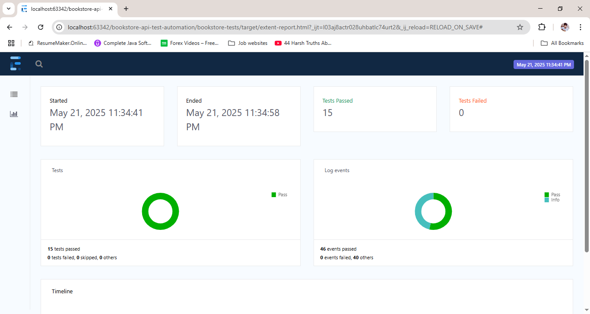
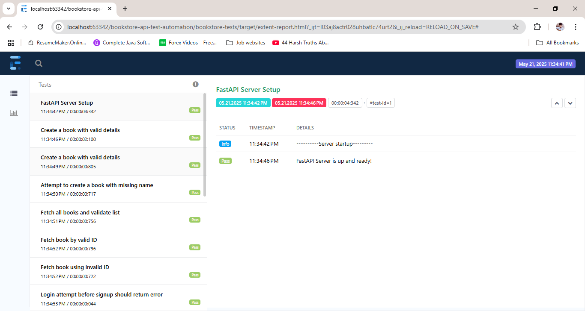

# Bookstore API Automation Project

This repository hosts a robust, end-to-end API automation framework tailored for a FastAPI-
based Bookstore application. It leverages Java with RestAssured and Cucumber (BDD) for test 
development and integrates Extent Reports for detailed test reporting. 
The framework includes automated server startup and is fully compatible with CI/CD pipelines using GitHub Actions


## Tech Stack

| Layer           | Technology         |
|----------------|---------------------|
| API Backend     | FastAPI            |
| API Automation  | Java + RestAssured |
| Test Framework  | Cucumber (BDD)     |
| Reports         | Extent Reports     |
| Build Tool      | Maven              |
| CI/CD           | GitHub Actions     |

## Project Structure

```
bookstore-api-test/
├── bookstore-main/             # FastAPI backend
│   ├── main.py                 # FastAPI app entry point
│   └── requirements.txt        # Python dependencies
├── src/
│   └── main/java/com/bookStore
│       ├── base/               # Request payload models
│       ├── config/             # Configuration reader
│       ├── service/            # API service classes
│       ├── utils/              # Utilities (reporting, server, etc.)
│   └── test/java/com/bookstore
│       ├── stepdefs/           # Step definitions
│       ├── hooks/              # Hooks for setup/teardown
├── features/                   # Cucumber feature files
│   └── BookManagement.feature
├── pom.xml                     # Maven config
└── README.md                   # Project documentation
```

## Setup & Execution

### 1. Backend Server (Automated)

There's no need to manually start the FastAPI server — it is automatically launched before test execution using Java's ProcessBuilder.

Example code:
```java
ProcessBuilder pb = new ProcessBuilder("uvicorn", "main:app", "--reload");
pb.directory(new File("bookstore-main"));
pb.redirectErrorStream(true);
```

### 2. Run Tests

```bash
mvn clean verify
```

- Starts the FastAPI server
- Executes all Cucumber test scenarios
- Generates an HTML test report

## Test Scenarios Covered

### Authentication

| Scenario Description              | Endpoint  | Method |
|----------------------------------|-----------|--------|
| Signup with valid data           | /signup   | POST   |
| Signup with existing email       | /signup   | POST   |
| Signup with missing fields       | /signup   | POST   |
| Login with valid credentials     | /login    | POST   |
| Login before signup              | /login    | POST   |
| Login with missing fields        | /login    | POST   |

### Book Management

| Scenario Description              | Endpoint         | Method  |
|----------------------------------|------------------|---------|
| Create book with valid details   | /books/          | POST    |
| Create book with missing name    | /books/          | POST    |
| Fetch all books                  | /books/          | GET     |
| Fetch book by valid ID           | /books/{id}      | GET     |
| Fetch book by invalid ID         | /books/{id}      | GET     |
| Update existing book             | /books/{id}      | PUT     |
| Update non-existing book         | /books/{id}      | PUT     |
| Delete book by ID                | /books/{id}      | DELETE  |
| Delete non-existing book         | /books/{id}      | DELETE  |

## Reporting

After test execution, view the detailed report:

```
target/cucumber-reports/ExtentReport.html
```

Includes:
- Scenario-wise results
- Request and response logs
- Assertions and validations

## CI/CD Pipeline

The project supports CI/CD integration using GitHub Actions.

### Sample GitHub Actions Workflow

```yaml
name: CI Pipeline

on: [push, pull_request]

jobs:
  test:
    runs-on: windows-latest

    steps:
    - uses: actions/checkout@v3

    - name: Set up Java
      uses: actions/setup-java@v3
      with:
        java-version: '17'

    - name: Install Python dependencies
      run: |
        cd bookstore-main
        pip install -r requirements.txt

    - name: Start FastAPI server
      run: |
        start uvicorn main:app --reload
      working-directory: bookstore-main

    - name: Run API Tests
      run: mvn clean verify
```


## execution - extent report Screenshot: 





## Author

**Rahul Kumar**  
Senior Test Engineer  
Expertise: Java, API Testing, RestAssured, Cucumber, Selenium
